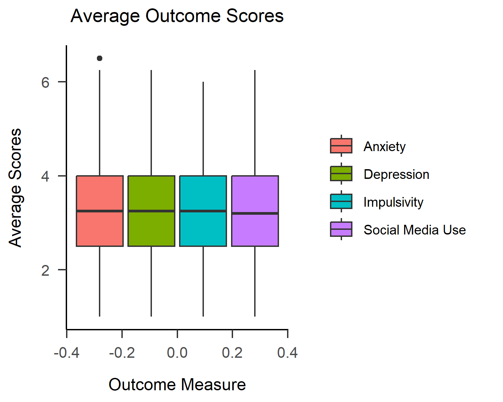

Natalie Cunningham^1^\ & Reviewer^1,2^

^1^ University of Minnesota

^2^ Other

&nbsp;&nbsp;&nbsp;&nbsp;&nbsp;&nbsp;&nbsp;&nbsp;&nbsp;&nbsp;&nbsp;&nbsp;&nbsp;&nbsp;&nbsp;&nbsp;&nbsp;&nbsp;&nbsp;&nbsp;&nbsp;&nbsp;&nbsp;&nbsp;&nbsp;&nbsp;&nbsp;&nbsp;&nbsp;&nbsp;&nbsp;&nbsp;&nbsp;&nbsp;&nbsp;&nbsp;&nbsp;&nbsp;&nbsp;&nbsp;&nbsp;&nbsp;&nbsp;&nbsp;&nbsp;&nbsp;&nbsp;&nbsp;&nbsp;&nbsp;&nbsp;&nbsp;&nbsp;&nbsp;&nbsp;&nbsp;&nbsp;&nbsp;&nbsp;&nbsp;&nbsp;&nbsp;&nbsp;&nbsp;&nbsp;&nbsp;&nbsp;&nbsp;&nbsp;&nbsp;&nbsp;&nbsp;&nbsp;&nbsp;&nbsp;&nbsp;&nbsp;&nbsp;&nbsp;&nbsp;&nbsp;&nbsp;&nbsp;&nbsp;&nbsp;&nbsp;&nbsp;&nbsp;&nbsp;&nbsp;&nbsp;&nbsp;&nbsp;&nbsp;&nbsp;&nbsp;&nbsp;&nbsp;&nbsp;&nbsp;&nbsp;&nbsp;&nbsp;&nbsp;&nbsp;&nbsp;&nbsp;&nbsp;&nbsp;&nbsp;&nbsp;&nbsp;&nbsp;&nbsp;&nbsp;&nbsp;&nbsp;&nbsp;&nbsp;&nbsp;&nbsp;&nbsp;&nbsp;&nbsp;&nbsp;&nbsp;&nbsp;&nbsp;&nbsp;&nbsp;&nbsp;&nbsp;&nbsp;&nbsp;&nbsp;&nbsp;&nbsp;&nbsp;&nbsp;&nbsp;&nbsp;&nbsp;&nbsp;&nbsp;&nbsp;&nbsp;&nbsp;&nbsp;

&nbsp;

Author note

The authors made the following contributions. Natalie Cunningham: Conceptualization, Writing - Original Draft Preparation, Writing - Review & Editing; Reviewer: Writing - Review & Editing, Supervision.

Correspondence concerning this article should be addressed to Natalie Cunningham, 75 E River Pkwy, Minneapolis, MN 55455. E-mail: cunni734@umn.edu

Abstract

Social media is becoming a new constant in the lives of high school youth, inducing worry among the public regarding the potential behavioral and mental health outcomes that social media use may have on adolescents. More research is required to fully understand the impact that social media use has on the adolescent brain and behavior, and should continue to be conducted as technology advances. This study looks at the relationship between social media and impulsivity, depression, and anxiety in high school youth through simulated data created by means of the 2023 Monitoring the Future continuing study conducted on eighth and tenth grade participants by the University of Michigan. Through the simulated data, it was found that there were no statistically significant relationships between social media use and the measured mental health and behavioral outcomes, nor was social media use seen as a predictor of these outcomes. However, with raw data, different results may be observed in these regards, and further analysis should be done on the raw data to assess these relationships.

<!-- https://tinyurl.com/ybremelq -->

*Keywords:* social media use, youth, mental health outcomes, behavioral outcomes

*Word count:* 1261

Social Media Use in Youth and Related Mental Health and Behavioral Outcomes

# Introduction

Technology is rapidly advancing and becoming more accessible to the adolescents of ours and future generations. With this accessibility, the doors to social media access and use are wide open to youth. Simultaneously, however, mental health and behavioral issues among youth are being more widely addressed. Many claims have been made that social media, and media use in general, have negative effects on children's well-being. New trends related to parenting methods with regards to technology access are widespread, and concern grows as younger and younger generations seem to be awarded access to technologies that appear to be harmful. These technologies and media platforms will continue to evolve, and, therefore, it is becoming increasingly necessary to understand the psychological impacts of these growing entities on youth. For the sake of this notion, I analyzed how social media use parallels adolescent levels of mental health and behavioral outcomes, specifically impulsivity, depression, and anxiety. The focus of this study is to use reproducible workflows to examine these relationship among a population of high-school aged youth.

Three hypotheses were created for how I expected social media use to impact impulsivity, depression, and anxiety in the surveyed participants. All three hypotheses infer that social media use will be positively correlated with each outcome, respectively, so higher use of social media will correspond with higher levels of impulsivity, depression, and anxiety.

To asses these, analyses were done on a simulated data set compiled referencing the data codebook from the 2023 Monitoring the Future Main Study, conducted on eighth and tenth grade participants by the University of Michigan [insert citation]. The hypotheses were analyzed using the simulated data to outline the procedure and method by which these research questions could be assessed in a reproducible manner. This project also provides the foundation structure for future analysis of the hypotheses without the confines of simulated data and instead with the provided raw data from which the simulated data set was formulated. 

# Methods

The current study was not preregistered and raw data was not collected or analyzed. Simulated data was created based on raw data from the 2023 study on eighth and tenth graders from the “Monitoring the Future” continuing study. Simulated data and code are available at [this hyperlink to the github repository](https://github.com/cunningpsych/Social-Media-Use_in_Youth).

## Participants

Table: (\#tab:demographics table) Demographics

Category                         n       \%   
-----------------------------  ------  -------
Race                                          
\ \ \ \ Black                   2194    14.89 
\ \ \ \ White                   5328    36.16 
\ \ \ \ Hispanic                2792    18.95 
Gender                                        
\ \ \ \ Female                  6170    41.88 
\ \ \ \ Male                    6392    43.38 
\ \ \ \ Other                   731     4.96  
\ \ \ \ Prefer Not to Answer    704     4.78  
Grade Level                                   
\ \ \ \ Eighth Grade            5956    40.42 
\ \ \ \ Tenth Grade             8778    59.58 
Residence                                     
\ \ \ \ Farm                    5012    34.02 
\ \ \ \ Country                 1515    10.28 
\ \ \ \ City                    7470    50.7  

*Note.* From simulated sample population. N = 14,734

&nbsp;

The sample used in this current study is a simulated data set based on the 2023 data codebook from the "Monitoring the Future" continuing study of different aspects and behaviors of high school students [insert citation]. The original data set consisted of 14734 participants in either eighth or tenth grade. The simulated data set, in turn, also included 14734 simulated participants, with 36.16% identifying as white, 40.42% in eighth grade, and 59.58% in tenth grade.

## Procedure

All demographics and measures were simulated in accordance with the codebook provided on the Monitoring the Future website [insert citation]. The codebook additionally provided the distributions for all recorded variables, which was used to determine scoring distributions for each simulated measure. For the sake of creating scales for outcome measures, a numerical scale was created, with higher values indicating higher levels of each outcome. Due to the nature of the data being entirely simulated, using Cronbach's alpha values to assess the reliability of the social media use, impulsivity, depression, and anxiety measures are not particularly informative (alpha =0.01, -0.01, 0.01, -0.03 respectively). These values are not very promising in terms of the internal reliability of the measure scales, however, with the use of genuine raw data, we may observe more favorable results.

# Results

Given the bounds to work with raw data, I would plan to explore how social media use is related to impulsivity, depression, and anxiety among adolescents. With the simulated data, I was able to calculate Pearson's r correlations, conduct t-tests, and create regression models to connect the simulated social media use with each behavioral and mental health outcome and how each outcome differs between eighth and tenth graders.

For the sake of finding significance in the correlations between measures, 0.05 was use as a threshold for the p-values. Simulated social media use and impulse control were found to be weakly negatively correlated with a p-value above the threshold, indicating that either the nature of the simulated data is not representative of authentic data or the hypothesis that social media use and impulsivity are positively correlated can likely be disproved (Pearson's r = -0.01, *p* = 0.56). Social media use and depression values were weakly positively correlated with a p-value above the threshold, indicating that while the correlation is positive, as predicted, it is not a strong relationship (Pearson's r = 0.00, *p* = 0.73). Lastly, it was found that social media use and anxiety are weakly negatively correlated based on the simulated data, also indicating a weak relationship that can disprove the hypothesis formed for social media use and anxiety or an inaccurate representation of how the measures can be seen using raw data and participants (Pearson's r = -0.01, *p* = 0.59).

T-tests were performed to compare how participants scored on social media use, impulsivity, depression, and anxiety scales based on grade level. Most items were scored on a scale from 1 to 5, with 1 being lower levels of the measure and 5 being high levels of the measure. For social media use, there was not a particularly large observed difference between how eighth and tenth graders were scoring, with the average groups means at 3.87 and 3.87 for eighth and tenth grade, respectively (t-statistic = -0.14, *p* = 0.89). Similar results were found for impulsivity, and while the difference between the grade levels was found to be higher, the average scores were also quite similar, at 2.03 and 2.03 for eighth and tenth grade, and the p-value denoted a lack of significance (t-statistic = 1.08, *p* = 0.28). The depression measure also saw comparable results, with average scores of 2.61 and 2.60 (t-statistic = 0.86, *p* = 0.39). Comparing the grade levels on the anxiety measure again saw similar group means for the measure separated by grade, with eighth and tenth graders averaging scores of 3.53 and 3.50, respectively (t-statistic = 1.72, *p* = 0.09). Overall, these results showed very little difference between how eighth and tenth graders scored on any of the simulated behavioral or mental health measures.

<!-- -->

Regression models were the last phase of analyses performed, used to assess whether social media use could predict the mental health and behavioral outcomes of impulsivity, depression, and anxiety, that were measured. Based on the simulated data analyses, social media use was found to not be a possible predictor or impulsivity, depression, or anxiety, although we may expect to see different results using raw data. For social media use as a predictor of impulsivity, the regression coefficient was -0.0036 (*p* = 0.56). Regarding social media use as a predictor of depression, the regression coefficient was 0.00 (*p* = 0.73). For the last of the models, social media use was analyzed as a predictor of anxiety, of which the regression coefficient was -0.01 (*p* = 0.59). Overall, from analyzing simulated data of the observed measures, no significant relationships were found between youth social media use and impulsivity, depression, or anxiety, and no significant differences were found between how eighth and tenth grade participants scored on the measures.

# Discussion

The purpose of this study was to mimic the workflow involved in creating reproducible research projects. All analyses were done using simulated data, so results are not representative of the true relationships between these variables that is observed in the raw data from 2023. Through the simulated analyses, no significant relationships between social media use and impulsivity, depression, or anxiety were noted, nor was a difference found between how eighth and tenth grade participants score on any of the observed measures. Therefore, none of the study hypotheses were supported by the simulated data. 

\newpage

# References

::: 
:::
